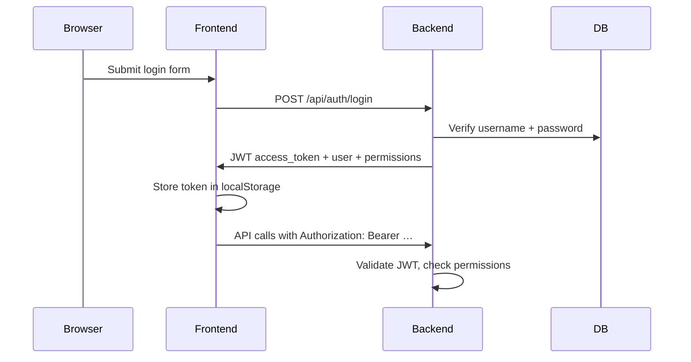

# Authentication

This template supports **dev-mode username/password login** today. Production will use **Microsoft Entra** (Azure AD) for staff authentication.

Authentication answers: **"Who is this person?"**

App permissions (what they can do in *this* app) are handled separately — see [App User Permissions](./app_user_permissions.md).

---

## How it works today (dev mode)



### Key files

| File | Purpose |
|------|---------|
| `app/core/auth.py` | JWT creation and validation |
| `app/core/config.py` | `AUTH_ENABLED`, `JWT_SECRET_KEY`, dev admin credentials |
| `app/api/routes/auth.py` | `/api/auth/login`, `/api/auth/me`, `/api/auth/config` |
| `app/api/deps.py` | `get_current_user`, `require_permission` dependencies |
| `app/services/auth_service.py` | Login logic, dev admin seeding |
| `frontend/src/services/authService.ts` | Login/logout, token storage |
| `frontend/src/hooks/useAuth.tsx` | React auth context |
| `frontend/src/pages/LoginPage.tsx` | Sign-in UI |

### Environment variables

```env
AUTH_ENABLED=true
JWT_SECRET_KEY=change-me-in-production-use-openssl-rand-hex-32
JWT_EXPIRE_MINUTES=480
SEED_DEV_ADMIN=true
DEV_ADMIN_USERNAME=admin
DEV_ADMIN_PASSWORD=admin123
```

### Default dev admin

When `SEED_DEV_ADMIN=true` and no admin user exists, the app creates:

- **Username:** `admin` (override with `DEV_ADMIN_USERNAME`)
- **Password:** `admin123` (override with `DEV_ADMIN_PASSWORD`)
- **App role:** `admin` (full permissions)

Sign in at http://localhost:5173/login.

### API endpoints

| Method | Path | Auth required | Description |
|--------|------|---------------|-------------|
| GET | `/api/auth/config` | No | Returns `{ auth_enabled: bool }` |
| POST | `/api/auth/login` | No | Username/password → JWT + session info |
| GET | `/api/auth/me` | Yes | Current user, role, permissions |

### Frontend session

After login, the JWT is stored in `localStorage` under `apex_auth_session`. Every API call through `api.ts` sends `Authorization: Bearer <token>`.

Call `logout()` from `useAuth()` to clear the session.

---

## Disabling authentication

For public tools that need no login:

```env
AUTH_ENABLED=false
```

When disabled:

- All permission checks are bypassed on the backend
- `ProtectedRoute` renders children without redirecting
- `hasPermission()` returns `true` for everything

---

## The `users` table (dev only)

The local `users` table stores username, hashed password, and profile fields for dev login. It is **not** the long-term identity store.

| Column | Purpose |
|--------|---------|
| `username` | Dev login identifier |
| `hashed_password` | PBKDF2 hash (dev only — no passwords with Entra) |
| `entra_oid` | Reserved — links to central identity when Entra is integrated |
| `full_name`, `email`, `department` | Profile fields |

When Entra is live, identity profile data will come from a **shared central users database**. This table may become a cache or be removed in favor of `entra_oid`-only references in `app_members`.

---

## Future: Microsoft Entra integration

Entra replaces dev login — it does **not** replace app permissions.

### What changes

| Layer | Dev (today) | Production (Entra) |
|-------|-------------|-------------------|
| Login UI | `/login` form | MSAL.js redirect / popup |
| Token | Self-signed JWT from `/api/auth/login` | Entra-issued JWT |
| Backend validation | `decode_access_token()` with `JWT_SECRET_KEY` | Validate against Entra JWKS (issuer, audience, signature) |
| User identity | Local `users` table | Token claims (`oid`, `name`, `email`) + central users DB |
| Authorization | `app_members` table (unchanged) | `app_members` keyed by `entra_oid` |

### What stays the same

- `app_members`, `roles`, `permissions` tables
- `require_permission()` on backend routes
- `ProtectedRoute` and `hasPermission()` on frontend
- Permission codenames like `settings.access`

### Integration checklist (when ready)

1. Register the app in Microsoft Entra (app registration, redirect URIs)
2. Add MSAL.js to the frontend (`@azure/msal-browser`)
3. Replace `LoginPage` with Entra redirect flow
4. Replace `app/core/auth.py` JWT validation with Entra token validation
5. On first login, upsert `app_members` row keyed by `oid` claim
6. Remove or gate dev password login behind `DEV_MODE` only
7. Set `JWT_SECRET_KEY` / Entra config in `.env` — never commit secrets

### Mapping Entra identity to app permissions

```text
Entra token (oid, email, name)
        ↓
Central users DB (shared — managed separately)
        ↓
app_members.entra_oid → role → permissions
```

The central users DB agent handles shared profile storage. This app only needs the `entra_oid` on `app_members` to resolve permissions.
