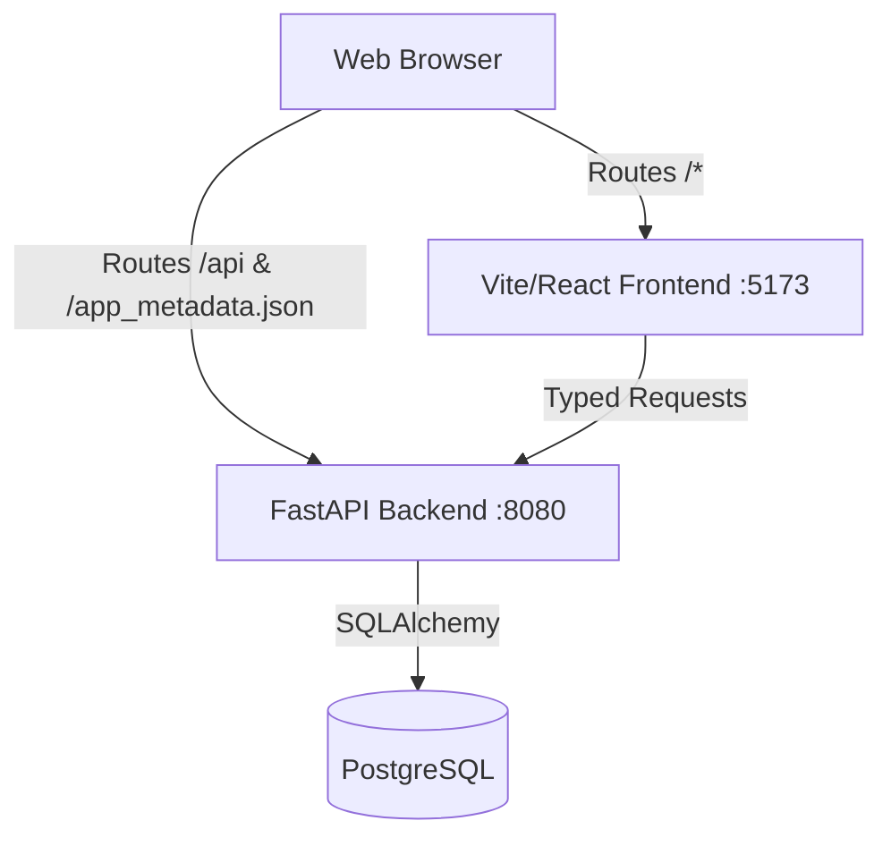

# Apex Application Template

The **Apex Application Template** is the standardized starting point for all web application development within the Town of Apex.

This repository uses a **React + Vite + TypeScript** frontend and a decoupled **FastAPI** backend serving as a REST API layer.

---

## Architecture overview

The system is split into two independent services operating over a shared API data contract:



### Frontend (`/frontend/src/`)

Built on **React 19**, **Vite**, **TypeScript**, and **Tailwind CSS**.

- **Routing** (`App.tsx`, `AppShell.tsx`) — React Router with a shared header/footer layout
- **Branding** (`useAppMetadata.ts`) — loads `app_metadata.json` at runtime for title, version, footer
- **Service layer** (`services/`, `types/`) — all API calls go through typed service modules, not raw `fetch` in pages
- **Styling** (`styles/globals.css`) — Apex Design System v2.0 tokens + Tailwind

See [Frontend Guide](./frontend-guide.md) and [UI Design Summary](./ui-design-summary.md) for more detail.

### Backend (`/app/`)

A lean Python/FastAPI service.

- **Models** (`app/models/`) — SQLAlchemy ORM; auto-discovered on startup
- **Services** (`app/services/`) — business logic; `BaseService` provides generic CRUD
- **Routes** (`app/api/routes/`) — thin HTTP wrappers registered in `app/main.py`
- **Config** (`app/core/config.py`) — single source of truth for environment variables

See [Database Configuration](./database-configuration.md), [Database Migrations](./database-migrations.md), [Authentication](./authentication.md), and [App User Permissions](./app_user_permissions.md).

---

## Local development

### Quick start (Windows)

```powershell
.\run_dev.ps1
```

This will:

1. Copy `.env.example` → `.env` if missing
2. Start a local PostgreSQL container (`docker-compose.dev.yml`)
3. Launch the FastAPI backend (separate terminal) — runs migrations on startup
4. Launch the Vite frontend at http://localhost:5173

Default dev admin login: **admin** / **admin123** (see [Authentication](./authentication.md)).

### Docker Compose dev

```bash
docker compose -f docker-compose.dev.yml up --build
```

Runs Postgres, backend, and frontend with hot reload on a local `dev` network (no shared `apex-internal` network required).

### Host-only frontend

```bash
cd frontend
npm install
npm run dev
```

Vite proxies `/api` to `http://localhost:8080` when running outside Docker.

---

## Adding a new feature

Example: a "Vehicle Logs" resource.

### Backend

1. **Model** — `app/models/vehicle_log.py` inheriting from `Base`
2. **Schema** — `app/schemas/vehicle_log.py` (`Create`, `Update`, `Read`)
3. **Service** — `app/services/vehicle_log_service.py` extending `BaseService`
4. **Route** — `app/api/routes/vehicle_logs.py`, register in `app/main.py`
5. Restart — dev mode auto-generates an Alembic migration if the model changed (see [Database Migrations](./database-migrations.md))

### Frontend

1. **Types** — `frontend/src/types/vehicleLog.ts`
2. **Service** — `frontend/src/services/vehicleLogService.ts` using `get`/`post`/`put`/`del` from `api.ts`
3. **Page** — `frontend/src/pages/VehicleLogsPage.tsx`
4. **Route** — add to `frontend/src/App.tsx`
5. **Navigation** — add to `frontend/src/lib/navigation.ts`

If the page should be restricted, see [App User Permissions](./app_user_permissions.md).

---

## Technical stack

| Layer | Technologies |
|-------|-------------|
| Frontend | React 19, TypeScript, Vite, Tailwind CSS, Lucide, Sonner |
| Backend | Python 3.13, FastAPI, SQLAlchemy 2.0, Alembic |
| Database | PostgreSQL 16 (primary), SQLite (dev fallback) |
| Auth | JWT (dev), Microsoft Entra (planned) |
| Proxy | Traefik (production) |
| Containers | Docker & Docker Compose |

---

## Roadmap & notes

### To-dos

- Separate dev vs production frontend build workflows (`npm run dev` vs `npm run build`)
- Microsoft Entra SSO integration (see [Authentication](./authentication.md))
- Collapsible sidebar navigation

### Completed

- PostgreSQL connection architecture with dev container and centralized production DB
- Alembic migrations with dev auto-migrate
- App-local RBAC (admin/user roles, permission-gated settings)

### Known tweaks

- Non-theme settings don't persist yet
- Theme-aware button hover states need refinement
- CSS consolidation review pending
